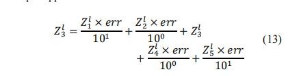
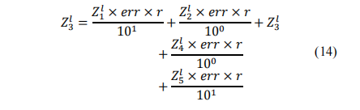

## Effect_of_injected_noise_in_deep_neural_networks
In DNN, to avoid overfitting, they tried to inject noise by
* Area of Influence(AOI) Noise  
addition of a tapered percentage of the input given to each neuron present 

* Random AOI  
r is a Gaussian noise 

* Line Noise 
a small Gaussian noise added to the output of each neuron in the network which can be interpreted as propagation noise which we call line noise

Test on MNIST, result is 
1. AOI noise: When the AOI value is 10, the recognition rate increases from 71.39% without noise to 79.48%.
2. Random AOI noise: Randomness enhances the exploration ability, but the improvement is relatively small, with a maximum of 77.7%.
3. Linear noise: When the standard deviation is 5%, the recognition rate increases to 77.41%, but too much noise will reduce performance.

## Noise_injection_into_inputs_in_back-propagation_learning
Similar to the one above, a really old paper, doing experiment on a tiny neutral network. Injected a random vector `d` as noise at the input layer. Mathematically proved why it can enhance the behavior as well. 

# ViT Original Paper
1. Image-to-Sequence Conversion:

    The input image is divided into patches of size P×P (e.g. 16×16), each of which is mapped to a vector via linear projection. 
    A learnable **Position Embedding** is used to encode the position of the patch. 
    For classification, a special **[CLS] token** is added, similar to the design of BERT.

2. Transformer Architecture:

    Standard Multi-head Self-Attention and Feedforward Network (MLP) layers are used. 
    Residual Connections and Layer Normalization are introduced.

3. Pre-training and Fine-tuning:

    Supervised pre-training is performed on a large-scale dataset (such as JFT-300M), followed by fine-tuning on a small-scale dataset. 
    Fine-tuning at higher resolutions is supported to enhance performance.